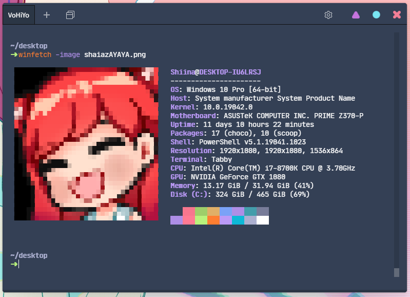

# Powershell like Shiina

## Install [scoop](https://scoop.sh/)
Run both these commands
```
Set-ExecutionPolicy RemoteSigned -scope CurrentUser

Invoke-Expression (New-Object System.Net.WebClient).DownloadString('https://get.scoop.sh')
```

## Fish like autosuggestions
```
Install-Module PSReadLine -RequiredVersion 2.1.0
```


Use ``notepad $profile`` to to open profile and put in it
```
Import-Module PSReadLine
Set-PSReadLineOption -PredictionSource History
```

In case the backdrop is too hard to read change the color like this:
```
Set-PSReadLineOption -Colors @{ InlinePrediction = '#6478ff'}
```
[More info here](https://devblogs.microsoft.com/powershell/announcing-psreadline-2-1-with-predictive-intellisense/)

## [Starship prompt](https://starship.rs/)

Make sure you have a [Nerd font](https://www.nerdfonts.com/) installed, pick your favourite

Simply run  ``scoop install starship``  and suffix ``Invoke-Expression (&starship init powershell)`` in your PROFILE.

## [LS Deluxe](https://github.com/Peltoche/lsd#description)
Gives you a cooler Dir with icons and some configuration options.

```
Scoop install lsd
```
Examples  


Config is placed in ``%APPDATA%\lsd\config.yaml``
## Simple Bash like DIR
Place in PROFILE, change **la** for a different alias

```
function la {
  param(
    [Switch] $lrt
  )
  if ( $lrt ) {
    Get-ChildItem | Sort-Object LastWriteTime
  }
  else {
    Get-ChildItem $args -Exclude .*  | Format-Wide Name -AutoSize
  }
}
```

## Cool finished product kinda?
Using [Tabby](https://github.com/Eugeny/tabby) wow very cool. Other things included maybe I'm lazy now.  

